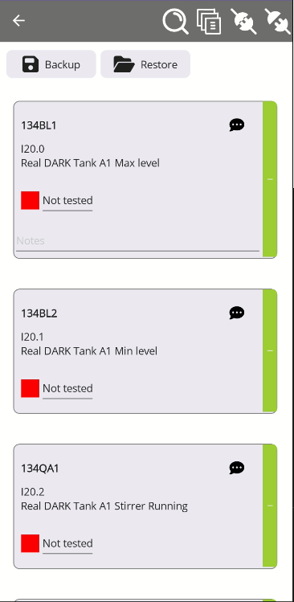
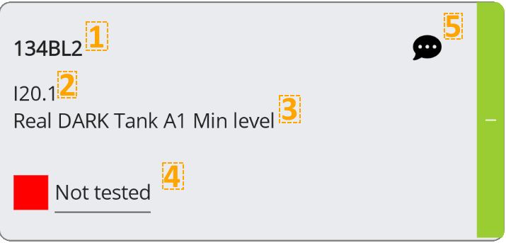
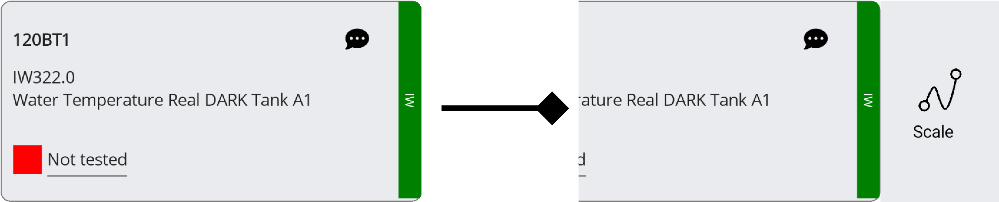
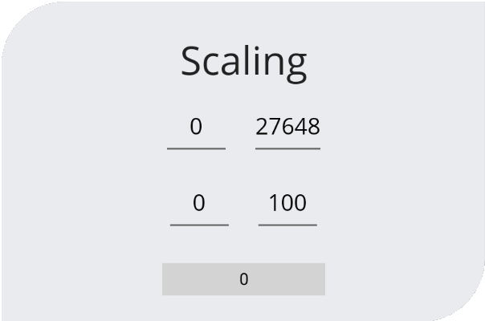

icon:material/text-box-multiple

# Compilazione variabili

Dopo aver  [creato le variabili](../EasyCheckIO/CreateVariable.md) in basso troverete il pulsante `compile` per lanciare la lista variabili nella sezione di compilazione.

## Compilazione 

Nella pagina di compilazione troviamo i comandi per compilare la lista e andare online con il PLC.

{style width=50 align=left}
- __Compile__ : Compila la lista e crea la tabella delle variabili.

 

Cliccando il tasto `compile` si generare la lista con tutti i dati inseriti nella pagina precedente.

{style width=150}

## Visualizzazione variabile

Ogni variabile a la propria sezione con le sue proprietà.

{ width="250" }

1. Nome della variabile
2. Indrizzo
3. Commento variabile
4. Stato della variable, cliccandolo si aprira un menu a tendina dove si può selezionare se è stato testato o è ancora pendente.
    - __`Not Tested`__ = variabile non testata.
    - __`Partialy Tested`__ Tested = Testata parzialmente. 
    - __`Tested`__ = Variabile testata.

Le variabile analogiche hanno a disposizione un menu aggiuntivo nascosto, per accederci trascinate la casella verso sinistra.

Su questo menu è possibile scalare la variabile analogica in modo da avere un valore più adeguato per eseguire il test.

{ width="250" }

