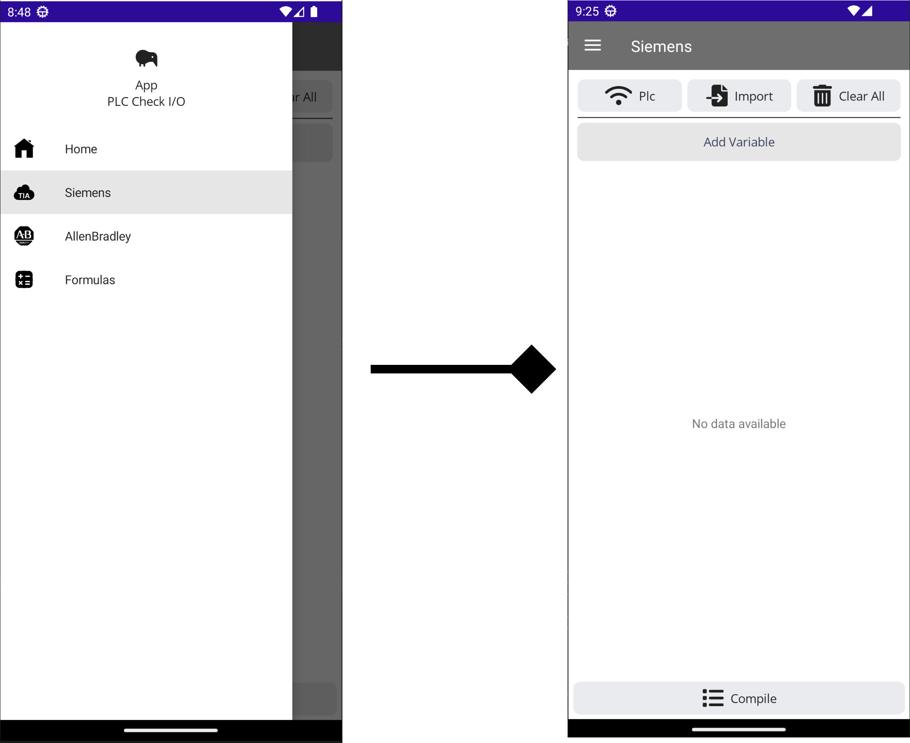
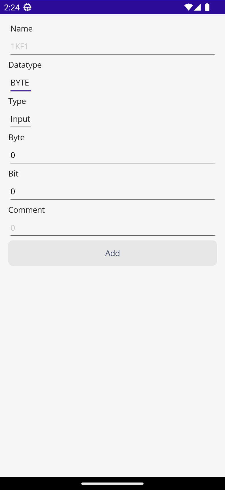
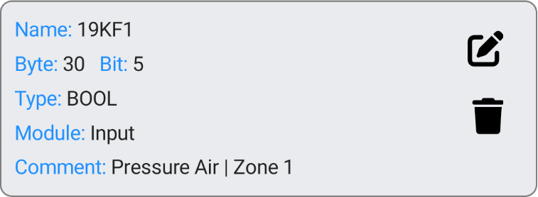

icon: material/tag
# Creazione variabili

Dal menu a tendina selezionate  __`Siemens`__ per aprire il menu di configurazione delle variabili. 

<center>
{ width="450" }
</center>

In questa pagina iniziamo a configurare le variabili che vogliamo leggere dal PLC.

---
## Aggiungere variabili

Per aggiungere una variabile clicca sul pulsante __`Add Variable`__.

{width="300" }

In questa pagina si configura sia dove verrà letta la variable e il tipo di formato di visualizzazione.

{width="150" align=left}

- __`Name`__ = Nome variabile.
- __`Datatype`__ = Tipo di formato per visualizzare la variabile.
- __`Type`__ = Il tipo di variabile:
    + Digital Input
    + Analogic Input
    + Digital Output
    + Analogic Output
- __`Byte`__ = Byte della variabile che vogliamo andare a leggere.
- __`Bit`__ = Bit della variabile che vogliamo andare a leggere, non caso si scelta `Analogic` questa selezione viene ignorata.

<br/>


<div class="result" markdown>

!!! nota

    Se voglia leggere la variabile __`I30.5`__ nelle impostazione dovremmo mettere:
    ```yaml
    Datatype = Bool
    Type = Digital Input
    Byte = 30
    Bit = 5
    ```
</div>

Cliccando su `Add` si aggingeremo la variabile alla lista.

{width="400"}

Nel riassuntivo che ci appare possiamo vedere i dati della variabile che abbiamo creato, con le relative opzione per modificarlo o cancellarlo.

 >   :fontawesome-solid-pen-to-square: = Modifica variabile.
>
 >   :fontawesome-solid-trash: = Cancella variabile.

---
## Importare le variabili

 Oltre ad aggiungere le variabili manualmente e possibile importare una lista in excel oppure esportarla direttamente dal  __`TiaPortal`__.


 Name | Path | Data Type | Logical Address | Comment |
--- | --- | --- | --- | --- |
134BL1 |	I/O Storage	| Bool |	%I20.0 | DARK Tank A1 Max level
135BL1 |	I/O Storage | Bool |	%I21.0 | Compound DARK Tank B1 Max level

le variabili devono essere di tipo primitive non è presente il supporto di _Datatype_, nel caso siano presenti verrano ignorate e non inserite nella lista.

{ width="150" align=left }

__`Import`__ - Permette di importare la lista della variabili esporte dal __`PLC`__ o tramite excel.


