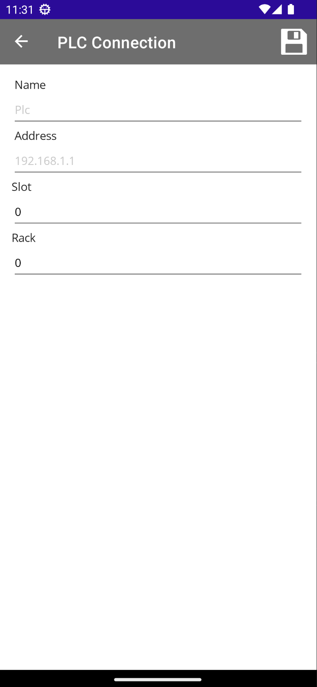

icon:material/lan-pending
# Configurazione PLC


## Configurazione TiaPortal
Nella configurazione hardware del PLC bisogna andare ad abilitare la comunicazione tramite `Put/Get`.

```pas
- Protection&Security
    - Connection Mechanisms
            [x] Permit access PUT/GET communication from remote partner
```

---
## Configurazione comunicazione 

{ width="150" align=left }
Per configurare la comunicazione con il PLC basterà andare nel menu siemens e cliccare su __`PLC`__.

Cliccando sul pulsante entreremo nel pagina di configurazione.

{ width="150" align=left }

- __Name__ = Nome del Plc (opzionale)
- __Address__ = Indirizzo Ip _192.168.0.1_
- __Slot__ = Posizione slot nella configurazione hardware del TIA
- __Rack__ = Predisposizione non utilizzato in Siemens.
</br></br></br>
</br></br></br>
</br></br></br>

Una volta inserito i dati per salvarli clicclate sul dischetto in alto a sinistra.

