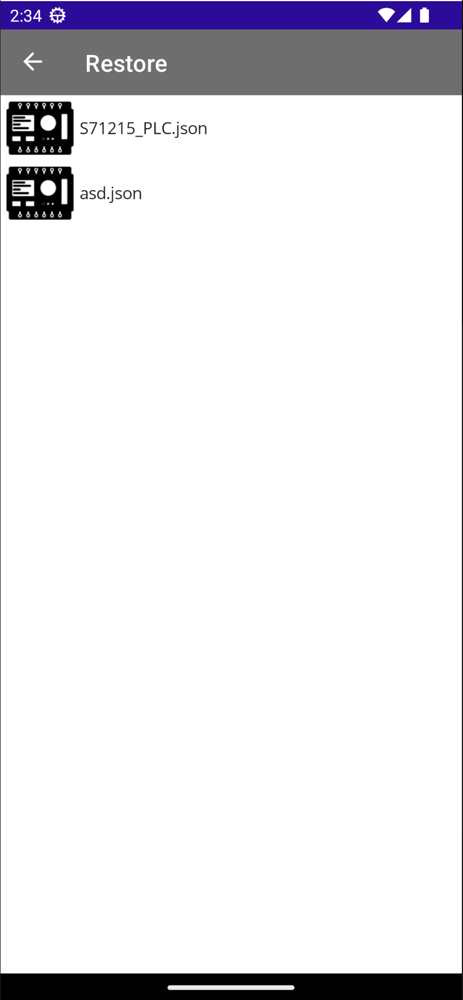

icon:fontawesome/solid/floppy-disk

# Backup&Restore

Per eseguire il backup&Restore della lista attuale  nella pagina compile sono presenti due pulsanti.

{style width=250}

Cliccando su __`backup`__ vi chiederà come chiamare il file da salvare.

Cliccando su __`restore`__ si andrà nella pagina di restore dove è possibile caricare i backup.

{style width=150}

Cliccando sul file desiderato si aprire il menu di selezione.

{style width=50}

Nel menu abbiamo quattro opzione:

- __Play__ : Carica il file selezionato.
- __ExportToExcel__ : Esporta tabella del compile in excel.
- __Delete__ : Cancella file.
- __Close__ : Chiudi il menu a tendina.
 
 Clicclando su __`Play`__ verrano caricate nella pagina compile la lista delle variabili salvate.